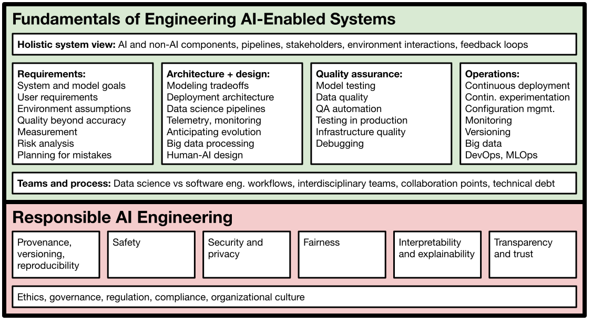
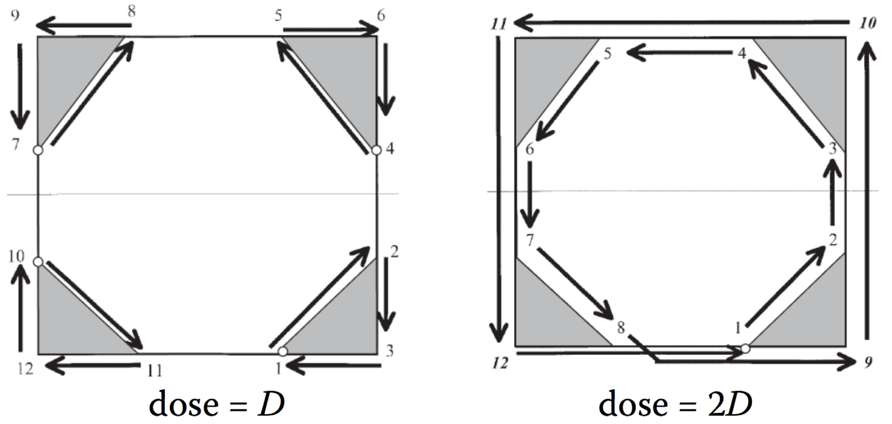
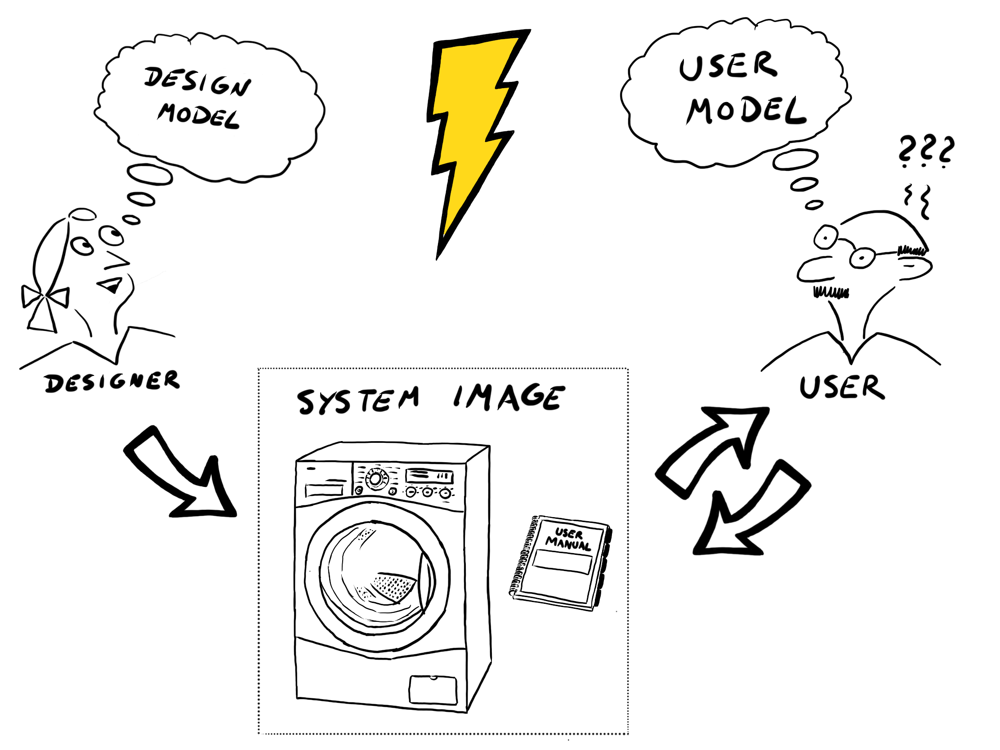
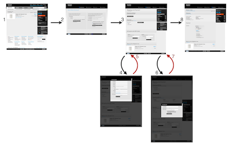
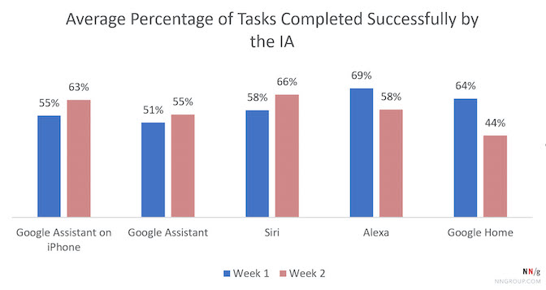
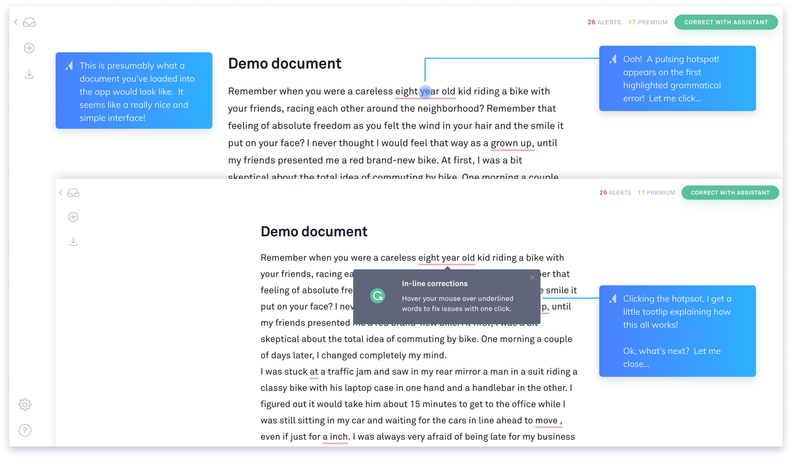
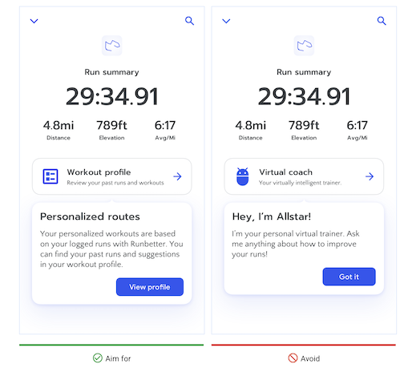
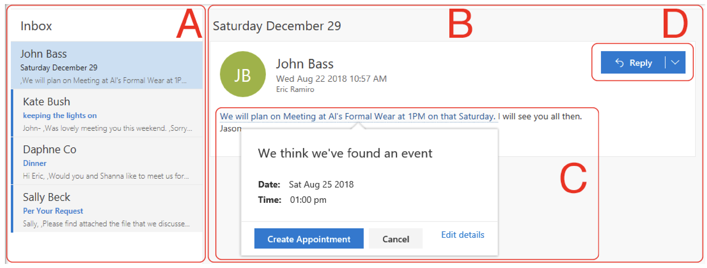

# Human-AI Interaction

Eunsuk Kang

<!-- references -->

Required reading:

Building Intelligent Systems by Geoff Hulten (2018),
Chapter 8.

_Guidelines for Human-AI Interaction_. Saleema Amershi, et al., in CHI 2019.

Optional reading:

_Will You Accept an Imperfect AI? Exploring Designs for Adjusting
End-user Expectations of AI Systems_. Kocielnik, et al., in CHI 2019

---
# Learning Goals

* Understand the risks of poor interaction design
* Understand the challenges behind designing human-AI interactions
* Understand the basic elements of user interaction design
* Consider design considerations for AI-based systems
  * Modes of interaction: Automate or augment?
  * Mental model: User understanding of what AI is doing
  * Dealing with errors: Guide user towards prevention & recovery
  * Feedback and control: Align user feedback with AI improvement

---
# What's coming next

<!-- .element: class="plain" -->

---
# Risks of Poor Interaction Design

----
## Poor Interaction Design Confuses Users

<!-- .element: class="stretch" -->

----
## Poor Interaction Design Annoys Users

<!-- .element: class="stretch" -->

<!-- ---- -->
<!-- ## Poor Interaction Design Hinders Users -->

<!--  -->
<!-- <\!-- .element: class="stretch" -\-> -->

----
## Poor Interaction Design Causes Harm

<!-- .element: class="stretch" -->

----
## Poor Interaction Design Causes Harm

<!-- .element: class="stretch" -->

----
## Poor Interaction Design Causes Harm

<!-- .element: class="stretch" -->

* Radiation therapy system at Panama City public hospital (2001)
  * Therapist draws block shapes to determine treatment area
  * Software computes final radiation settings

----
## Poor Interaction Design Causes Harm

<!-- .element: class="stretch" -->

* Same shape drawn in different order, double the radiation dose
* 28 patients overdosed; 8 dead
  * Therapists charged with 2nd degree murder (but are they really to blame?)

----
## Risks of Poor Interaction Design

* Interaction design is not just about visual presentation!
* Poor interaction design can:
<!-- .element: class="fragment" -->
  * Cause confusion or misunderstanding 
  <!-- .element: class="fragment" -->
  * Prevent the user from effectively performing their task
  <!-- .element: class="fragment" -->
  * Increase mental and physical burden
  <!-- .element: class="fragment" -->
  * Drive users away from the product
  <!-- .element: class="fragment" -->
  * Contribute to security or privacy issues
  <!-- .element: class="fragment" -->
  * Cause physical (injuries, deaths) and societal harms (bias, misrepresentation)
  <!-- .element: class="fragment" -->
  
---
# Usability Concepts

(This will be a brief tour to a complex subject. If you are interested,
consider taking [05-318/618: Human-AI Interaction](https://haiicmu.github.io/))

----
## Dimensions of Usability

* Learnability: How easy is it for users to accomplish tasks the
first time?
<!-- .element: class="fragment" -->
* Efficiency: After learning, how efficiently can users perform the
tasks?
<!-- .element: class="fragment" -->
* Memorability: Can users remember to perform the tasks after a period of
not using the system?
<!-- .element: class="fragment" -->
* Errors: How often do users make errors, how severe are these
errors, and how easily can they recover from the errors?
<!-- .element: class="fragment" -->
* Satisfaction: How pleasant is it to use the design?
<!-- .element: class="fragment" -->

<!-- references -->

https://www.nngroup.com/articles/usability-101-introduction-to-usability/

----
## Interaction Cost

<!-- .element: class="stretch" -->

* Mental and physical effort needed to perform a desired task
  * Task memorization & recall, context switch, track system state
  * Reading, scrolling, clicking, typing, waiting for UI changes
* __Goal of usable design__: Minimize interaction cost while
  allowing users to perform their tasks

----
## Usability & AI

<!-- .element: class="stretch" -->

* AI has potential to greatly reduce interaction costs
  * Automate tasks through personalization & predictions
* But also introduces new usability challenges
  * __Q. What's new or hard about AI-based systems?__

----
## Usability & AI

<!-- .element: class="stretch" -->

* AI has potential to greatly reduce interaction costs
  * Automate tasks through personalization & predictions
* But also introduces new usability challenges
  * __Unpredictability__: AI makes mistakes, sometimes unexpectedly
  * __Opaqueness__: User has difficulty understanding how system works
  * __Evolution__: AI behavior changes over time, surprising users
  

----
## Design Considerations for AI

* __Modes of interaction__: Automate or augment?
* __Mental model__: User understanding of what AI is doing
* __Dealing with errors__: Guide user towards prevention & recovery
* __Feedback and control__: Align user feedback with AI improvement

---
# Modes of Interaction

----
## Modes of Interaction

* Automate: Take action on user's behalf
<!-- .element: class="fragment" -->
* Augment: Provide options or additional information
<!-- .element: class="fragment" -->
  * Prompt: Ask the user if an action should be taken
  * Organize: Display a set of items in an order
  * Annotate: Add information to a display
* Hybrid of above
<!-- .element: class="fragment" -->

----
## Selecting Appropriate Mode of Interaction

* Identify the tasks that the user wants to achieve
* For each task, decide between __automate vs. augment__ 
* Automate when:
  <!-- .element: class="fragment" -->
  * User lacks knowledge/ability to perform the task (e.g., prediction)
    <!-- .element: class="fragment" -->
  * Boring, repetitive, dangerous tasks
    <!-- .element: class="fragment" -->
  * The effect of action can be reversed
    <!-- .element: class="fragment" -->
* Augment when:
<!-- .element: class="fragment" -->
  * High stakes & accountability is needed
     <!-- .element: class="fragment" -->
  * Difficult to communicate the user's need to AI
     <!-- .element: class="fragment" -->
  * User enjoys performing the task (e.g., driving)
     <!-- .element: class="fragment" -->

----
## Other Factors to Consider

* Forcefulness: How strongly to encourage taking an action?
<!-- .element: class="fragment" -->
	* Active: Automate action or interrupt user and ask for confirmation
	* Passive: Suggest action, but do not require immediate answer
* Frequency: How often does interaction occur?	
<!-- .element: class="fragment" -->
	* When a new prediction is available or model changes
	* Periodically (e.g., suggest action every hour)
	* Only when explicitly initiated by user 
* Cost: What is the effect of a wrong prediction?
<!-- .element: class="fragment" -->
	* If cost is too high, consider augmenting rather than automating
	* If possible, provide a way to undo the action of AI

<!-- ---- -->
<!-- ## Factors to Consider -->

<!--  -->
<!-- <\!-- .element: class="stretch" -\-> -->

<!-- Design suggestions/fall detection -->

<!-- __Q. Forcefulness, frequency, cost?__ -->

----
## Example: Design suggestions in PowerPoint

<!-- .element: class="stretch" -->

* Automate or Augment? Why?
* Forcefulness? (active vs. passive)
* Frequency?

----
## Example: Fall Detection

<!-- .element: class="stretch" -->

* Automate or Augment? Why?
* Forcefulness? (active vs. passive)
* Frequency?

---
# Mental Model

----
## Mental Model

<!-- .element: class="stretch" -->

* What the user believes about the system 
<!-- .element: class="fragment" -->
  * "How does the system work? How does it respond to my actions?"
  * User plans actions and reacts to system based on this mental model
* Challenge: Aligning system with the user's mental model
<!-- .element: class="fragment" -->
  * Inherent mismatch between user's & designer's models
  * User's model may be preconceived based on prior experience
  * User's model and/or system evolves over time

----
## Example: Shopping Cart Checkout 

<!-- .element: class="stretch" -->

Mental model for shopping cart = A linear sequence of familiar steps

1. Browse for items
2. Add items to cart
3. Choose checkout
4. Enter shipping & billing data
5. Press Order
6. Get confirmation

----
## Breaking Mental Model

* Anti-pattern: Interrupt linear flow & bring user back to a 
  previous step
  * Create an account, open a new dialog to enter
    preferred address...
  * Breaks user's mental model => failure to convert into sales
* ~60% of customers abandon their shopping cart

<!-- references -->
https://baymard.com/blog/checkout-process-should-be-linear

----
## Mental Model for AI-Based Systems

* User: "What is AI doing, and how do I use it?"
  * Opaqueness: Typically less transparent than traditional apps
  * AI will make mistakes, often unpredictably 
* Unclear inputs: What are possible actions? Which of these actions matter? When
does my action take effect?
<!-- .element: class="fragment" -->
* Lack of control over output: Why am I being given these
  recommendations? Why is the output displayed in this order?
<!-- .element: class="fragment" -->
* Lack of trust over output: How do I know the output is correct?
<!-- .element: class="fragment" -->

<!-- references -->
https://www.nngroup.com/articles/machine-learning-ux/

----
##  Mental Model for Voice Assistants?

__Q. Can you describe what it does? What it cannot do?__

<!-- * What can it do? What are its limitations? -->
<!-- * How do I get it to do/say  X? -->
<!-- * Why did it do/say Y instead of X?  -->

----
##  Mental Model for Voice Assistants?

* Unclear, inconsistent mental model
  * An interface for other services?
  * "Handy helper"?
  * Knowledge repository? Fact-finding tool?

<!-- references -->

https://www.nngroup.com/articles/mental-model-ai-assistants/

----
## Misalignment in Voice Assistants 

* AI often fails to meet user expectations
  * (1) User doesn't know how to get AI to do X
  * (2) User says X, but AI can't do X well
* Users settle on simple tasks over time; small but limited improvements

<!-- references -->

https://www.nngroup.com/articles/mental-model-ai-assistants/

----
## Misalignment in Mental Models

>“So, this week, I realized that I don't use my IA nearly as much as I thought I did. I do use it often. However it's very much normally the same like five things over and over again."

* User settles on a suboptimal mental model & fails to benefit from
  the full capabilities of AI

<!-- references -->

https://www.nngroup.com/articles/mental-model-ai-assistants/

----
## Principles for Aligning Mental Model 

* Identify user's existing mental models
<!-- .element: class="fragment" -->
	* Find similar apps & identify common patterns
	* User interviews, walkthroughs, prototype testing
* Design & evolve the system to conform to the user's model
  <!-- .element: class="fragment" -->
  * Collect & analyze errors made by user
  * Identify potential mismatch vs. user's mental model
* Improve/adjust the user's mental model
<!-- .element: class="fragment" -->
	* Set the user's expectations through onboarding	
	* Increase transparency and explain decisions made by AI
	* Allow user to adjust system behavior to match their expectations

----
## Onboarding: Set User's Mental Model

<!-- .element: class="stretch" -->

* Provide examples of how the system works

----
## Onboarding: Set User's Mental Model

* Be explicit about what system can and cannot do

<!-- references -->

https://pair.withgoogle.com/chapter/mental-models/

----
## Transparency: Explain How Decisions Are Made

<!-- .element: class="stretch" -->

* Explain how the user's input actions influence output

---
# Dealing with Errors

----
## Dealing with Errors

* User errors: Mistakes made by users (e.g., click on a wrong button)
  * Lots of work in cognitive science & human factors 
  * Error taxonomies, human performance modeling, task analysis,
  ergonomic analysis, etc.,
  * Often due to misalignment of mental models
* System errors: Failure to provide an outcome expected by the user
  * Due to mistakes made by an ML model
  * __Our focus in this lecture__

----
## Example: Scheduling Assistant

<!-- .element: class="stretch" -->

* Analyze e-mail content for possible meeting scheduling
* Suggest creating a new meeting based on inferred information

<!--references -->

_Will You Accept an Imperfect AI? Exploring Designs for Adjusting
End-user Expectations of AI Systems_. Kocielnik, et al. (CHI 2019)

----
## Dealing with Errors in ML

* Define types of errors & their costs
<!-- .element: class="fragment" -->
	* False positives vs. false negatives
	* Optimize for one with lower costs
	* Q. For meeting scheduling, which are more acceptable?
* Detect & record occurrences of errors
<!-- .element: class="fragment" -->
	* Collect telemetry or user feedback
	* Q. Telemetry to collect for meeting scheduler?
* Identify sources of errors
<!-- .element: class="fragment" -->
	* Poor/bias training data, noise in data, data drifts
* Provide meaningful error messages to the user
<!-- .element: class="fragment" -->
	* Provide an explanation for the error
	* Suggest actions to fix the error (e.g., "Edit details" option)
* Give user controls to recover from and mitigate the effect of an error
<!-- .element: class="fragment" -->
	* e.g., delete or modify incorrect meeting schedule

----
## Setting User Expectations for ML Errors

<!-- .element: class="stretch" -->

* Be upfront about how well the system performs (e.g., model accuracy)
* Temper the user's expectations and avoid surprises

<!--references -->

_Will You Accept an Imperfect AI? Exploring Designs for Adjusting
End-user Expectations of AI Systems_. Kocielnik, et. al. (CHI 2019)

----
## Error Messages: Suggest user actions

* Tell the user what the AI needs in order to behave as intended
* Guide the user towards ways to recover from/prevent further errors

<!--references -->

https://pair.withgoogle.com/chapter/errors-failing/

----
## Breakout: Dealing with Errors

<!-- .element: class="stretch" -->

Design suggestions/fall detection

* In #lecture, type:
  * Possible error(s):
  * How to detect the error:
  * How to allow the user to recover from error:
  * What additional data to collect (from user) to reduce future errors:

<!-- ---- -->
<!-- ## Errors in Voice Assistants -->

<!-- <\!-- colstart -\-> -->

<!--  -->
<!-- <\!-- col -\-> -->

<!-- > “...sometimes it says it does — like the reminders and the sending messages. It says it will do it. But then at the end we found that it didn’t really send the message.” -->
<!-- <\!-- colend -\-> -->

<!-- * __Q. How do we detect when AI makes an error__? -->
<!-- * __Q. How can we notify/guide the user when an error occurs__? -->

<!-- <\!-- references -\-> -->

<!-- https://www.nngroup.com/articles/mental-model-ai-assistants/ -->

---
# Feedback and Control

----
## Types of Feedback

* Implicit feedback: Data about user behaviors collected by system
<!-- .element: class="fragment" -->
  * e.g., times of day, duration of usage, 
    recommendations accepted/rejected, click patterns, etc.,
* Explicit feedback: Prompted or deliberately provided by user
<!-- .element: class="fragment" -->
  * Surveys, ratings, thumbs up, feedback forms, etc., 
* Design considerations for feedback
<!-- .element: class="fragment" -->
  * Align feedback with improving interactions (and AI)
  * Acknowledge user feedback & respond immediately 
* In addition to feedback, provide a way for user to adjust AI behavior
<!-- .element: class="fragment" -->

----
## Responding to Feedback

* When possible, respond to feedback with an adjustment to AI behavior

<!-- references -->

https://pair.withgoogle.com/chapter/feedback-controls/

----
## Giving User Control

* Provide a mechanism for user to adjust system behavior

----
## Giving User Control  over ML Behavior

* Provide a mechanism for the user to control the types of ML errors
* Scheduling assistant: Adjust thresholds to achieve trade-offs
  between precision vs recall

<!-- ## User Feedback in Voice Assistants -->

<!-- > "All of the things that even Siri herself said she could do — for example ‘I can send money via Venmo, just try and say this.’ I tried and it didn’t work, and maybe there are settings that I need to fix. But when those types of things happened, there was no button that said ‘Hey, in order to make this work in the future, click this and we’ll take you to the permissions or whatever’." -->

<!-- * __Q. How do we collect user feedback? Implicit? Explicit?__ -->
<!-- * __Q. What kind of control do we provide to the user?__ -->

<!-- <\!-- references -\-> -->

<!-- https://www.nngroup.com/articles/mental-model-ai-assistants/ -->

---
# Guidelines for Human-AI Interactions

----

<!-- .element: class="stretch" -->

----
# Human-AI Interactions

__Human-AI interactions must be considered throughout the entire ML
lifecycle!__

* Requirements & design
  * Understand user needs & their mental models
  * Explicitly design system to match the mental model
* During interaction
  * Consider factors for interaction (automate vs augment,
    forcefulness, frequency)
* When errors occur
  * Provide an explanation & actionable information
  * Provide ways for user to adjust AI behavior 
* Maintenance and evolution
  * Collect user feedback and improve model 
  * Adjust system design to reduce mental model mismatch

---
# Summary

* Goal of usable design: Minimize interaction cost 
  * Automation does not necessarily imply reduced cost!
* Interaction design considerations for AI
  * Modes of interaction: Automate or augment?
  * Mental model: User understanding of what AI is doing
  * Dealing with errors: Guide user towards prevention & recovery
  * Feedback and control: Align user feedback with AI improvement
